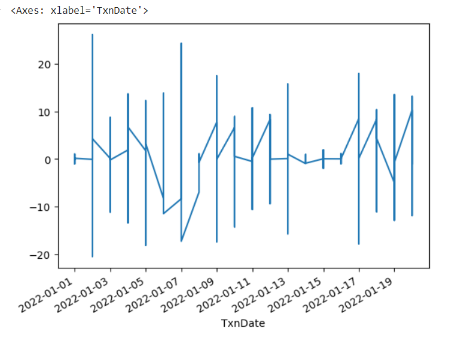
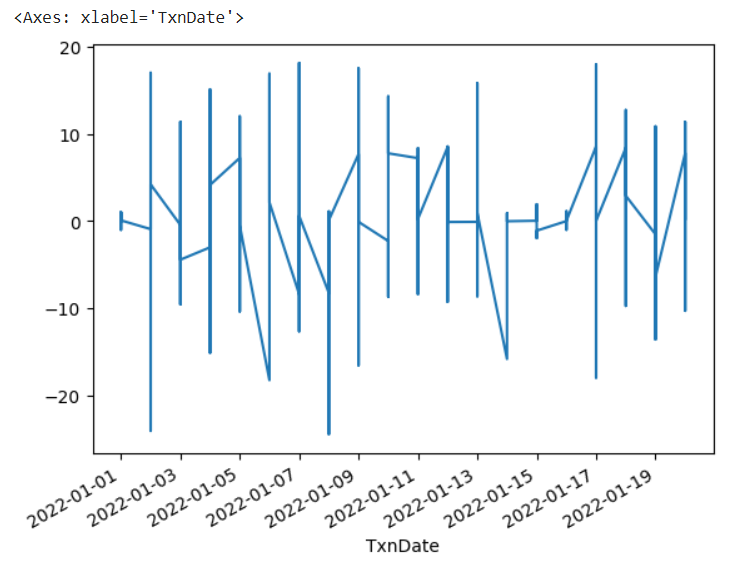
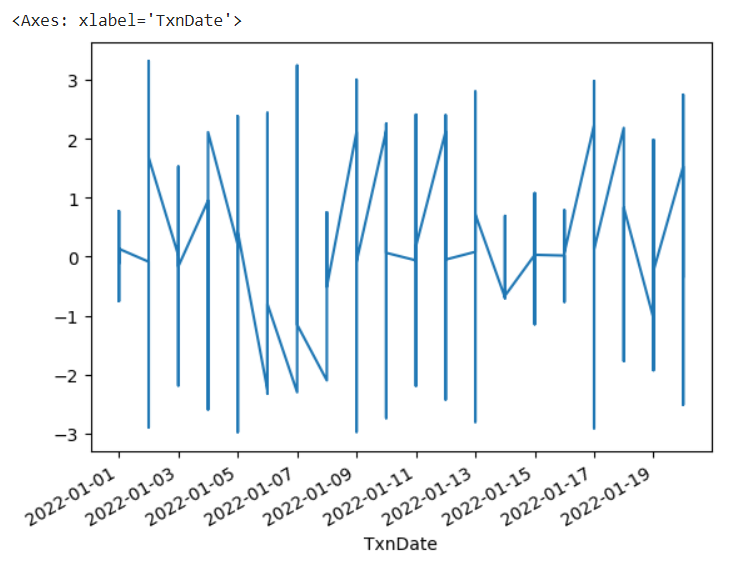

# Ex.No: 1B                     CONVERSION OF NON STATIONARY TO STATIONARY DATA

# Developed By: Shaik Shoaib Nawaz

# Register No: 212222240094

# Date: 

### AIM:
To perform regular differncing,seasonal adjustment and log transformatio on power consumption dataset
### ALGORITHM:
1. Import the required packages like pandas and numpy
2. Read the data using the pandas
3. Perform the data preprocessing if needed and apply regular differncing,seasonal adjustment,log transformation.
4. Plot the data according to need, before and after regular differncing,seasonal adjustment,log transformation.
5. Display the overall results.
### PROGRAM:
#### IMPORTING PACKAGES:
```
import pandas as pd
import numpy as np
import matplotlib.pyplot as plt
%matplotlib inline
```
#### Preprocessing:
```
train=pd.read_csv('/content/KwhConsumptionBlower78_1.csv')
train.timestamp=pd.to_datetime(train.TxnDate,format='%d %b %Y')
train.index=train.timestamp
train.drop("TxnDate",axis=1,inplace=True)
train.head()
print(train.columns)
train.columns = train.columns.str.strip()
train['Consumption'].plot()
```
#### REGULAR DIFFERENCING:
```
from statsmodels.tsa.stattools import adfuller
def adf_test(timeseries):
    print("Results of Dickey-Fuller Test:")
    dftest = adfuller(timeseries, autolag="AIC")
    dfoutput = pd.Series(dftest[0:4], index=["Test Statistic", "p-value", "#Lags Used", "Number of Observations Used"])
    for key, value in dftest[4].items():
        dfoutput["Critical Value (%s)" % key] = value
    print(dfoutput)
adf_test(train['Consumption'])
train['Consumption_diff']=train['Consumption']-train['Consumption'].shift(1)
train['Consumption_diff'].dropna().plot()
```
#### SEASONAL DIFFERENCING:
```
n=7
train['Consumption_diff']=train['Consumption']-train['Consumption'].shift(n)
train['Consumption_diff'].dropna().plot()
```
#### LOG TRANSFORMATION:
```
train['Consumption_log']=np.log(train['Consumption'])
train['Consumption_log_diff']=train['Consumption_log']-train['Consumption_log'].shift(1)
train['Consumption_log_diff'].dropna().plot()
```


### OUTPUT:


REGULAR DIFFERENCING:



SEASONAL ADJUSTMENT:



LOG TRANSFORMATION:



### RESULT:
Thus, The python code for the conversion of non stationary to stationary data of power consumption dataset is executed successfully.
